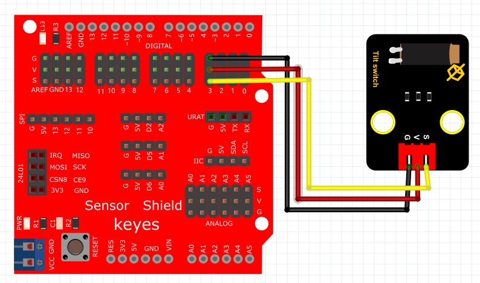

# Arduino


## 1. Arduino简介  

Arduino是一个开放源代码的电子原型平台，旨在通过易于使用的硬件和软件，使用户能够轻松地创建互动电子项目。自2005年推出以来，Arduino不仅在创客和教育领域中变得极为流行，也在原型开发和产品设计方面得到了广泛应用。Arduino硬件通常基于微控制器，具备多种输入/输出接口，能与各种传感器、模块和组件连接。Arduino IDE提供了一个用户友好的编程环境，允许用户使用C/C++语言进行编程，使得编程变得直观易懂。通过Arduino，用户可以开展从基础的LED闪烁到复杂的机器学习项目等多种应用。  

## 2. 连接图  

  

## 3. 测试代码  

```cpp  
int ledPin = 13; // 定义数字口13  
int inputPin = 3; // 定义数字口3  

void setup() {  
    pinMode(ledPin, OUTPUT); // 将ledPin设置为输出  
    pinMode(inputPin, INPUT); // 将inputPin设置为输入  
}  

void loop() {  
    int val = digitalRead(inputPin); // 设置数字变量val，读取到数字口3的数值，并赋值给val  
    if (val == LOW) { // 当val为低电平时，LED亮起  
        digitalWrite(ledPin, HIGH); // LED亮起  
    } else {  
        digitalWrite(ledPin, LOW); // LED变暗  
    }  
}  
```  

## 4. 测试结果  

根据连接图接好线，烧录好代码，通电后，当传感器倾斜到一边时，LED灯亮起；而倾斜到另一边时，LED灯熄灭。  

## 5. 加强训练  

代码：  

```cpp  
int led = 13; // 定义数字口13  
int inputPin = 3; // 定义数字口3  
int x; // 定义变量x  

void setup() {  
    pinMode(led, OUTPUT); // 将led设置为输出  
    pinMode(inputPin, INPUT); // 将inputPin设置为输入  
}  

void loop() {  
    int val = digitalRead(inputPin); // 读取输入口的值  
    if (val == 0) { // 如果值为0  
        x++; // x自增  
        digitalWrite(led, HIGH); // LED灯亮起  
        delay(500); // 延迟0.5秒  
    }  
    if (x == 2) { // 如果x达到2  
        digitalWrite(led, LOW); // LED灯熄灭  
        x = 0; // 重置x  
        delay(500); // 延迟0.5秒  
    }  
}  
```  

结果

上传代码后，倾斜传感器一次LED灯亮，再倾斜一次LED灯灭。这个功能的实现依赖于变量x，提供了一种思考编程及其逻辑关系的机会。


