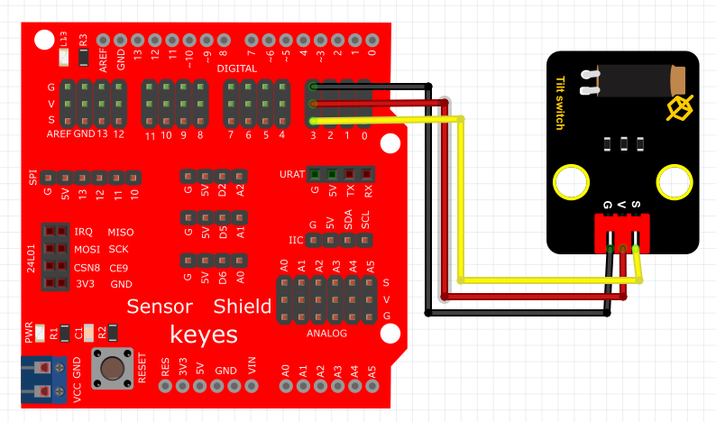

# KidsBlock

## 1. KidsBlock简介  

KidsBlock是一款适合初学者的图形化编程工具，旨在通过可视化的编程模块简化编码过程，使编程变得更加直观和有趣。用户可以通过简单的拖放操作创建各种电子项目，避免了传统编码中常见的语法错误。KidsBlock支持与多种硬件平台（如Arduino）集成，方便用户进行物理计算和控制。其友好的界面尤其适合孩子和顽皮的青少年，在学习编程的同时，也促进了逻辑思维能力和创造力的培养。  

## 2. 连接图  

  

## 3. 测试代码  

1. 在事件栏拖出Arduino启动模块。  

     

2. 在引脚栏拖出两个设置引脚模式模块，一个设置为引脚3输入，另一个设置为引脚13输出。  

     

3. 在控制栏拖出重复执行模块。  

     

4. 在控制栏拖出判断模块，然后在判断模块里添加运算的等于模块，等于模块的左边添加读取数字引脚3模块，右边为0；满足条件时第13引脚输出高电平，不满足条件时第13引脚输出低电平。  

     

## 4. 测试结果  

按照上图接好线，烧录好代码；通电后，当倾斜传感器到一边时，LED灯亮起；而倾斜到另一边时，LED灯熄灭。  

结果

上传代码后，倾斜传感器一次LED灯亮，再倾斜一次LED灯灭。实现这个功能的关键在于变量time，值得深入思考。

