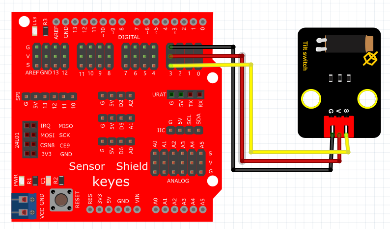

# Python


## 1. Python简介  

Python是一种高级编程语言，由Guido van Rossum于1991年首次发布。它强调代码的可读性和简洁性，并支持多种编程范式，包括面向对象、过程式和函数式编程。Python拥有一个庞大的标准库和丰富的第三方库，使得它在数据分析、人工智能、网络开发、自动化脚本等领域具有广泛的应用。其简洁的语法和强大的功能使其成为初学者和专业开发者的热门选择。同时，Python的社区活跃，提供了大量的学习资源和文档支持，助力学习和项目开发。  

## 2. 连接图  

  

## 3. 测试代码  

```python  
import machine  
import utime  

key = machine.Pin(28, machine.Pin.IN)  # 设置28脚为输入  
led = machine.Pin(25, machine.Pin.OUT)  # 设置25脚为输出  

while True:  
    if key.value() == 0:  # 判断输入是否为高电平  
        led.value(1)  # LED灯亮  
    else:  
        led.value(0)  # LED灯灭  
```  

## 4. 测试结果  

按照上图接好线，烧录好代码；通电后，当倾斜到一边时，LED灯亮起，倾斜到另一边时，LED灯熄灭。  

## 5. 加强训练  

代码：  

```python  
import machine  
import utime  

key = machine.Pin(28, machine.Pin.IN)  
led = machine.Pin(25, machine.Pin.OUT)  
val = 0  

while True:  
    if key.value() == 0:  
        val += 1  
        led.value(1)  
        utime.sleep_ms(300)  
    if val == 2:  
        led.value(0)  
        val = 0  
        utime.sleep_ms(300)  
```  

结果

上传代码后，倾斜传感器一次LED灯亮，再倾斜一次LED灯灭。实现这个功能的关键在于变量val，值得深入思考。


